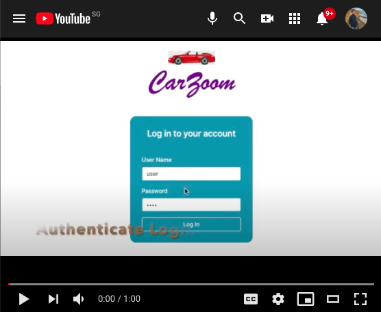
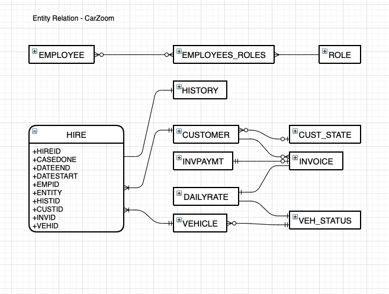
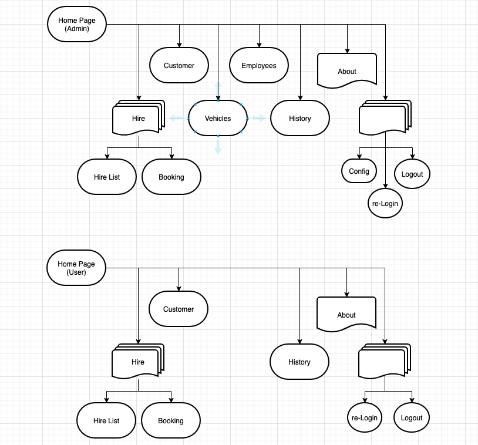
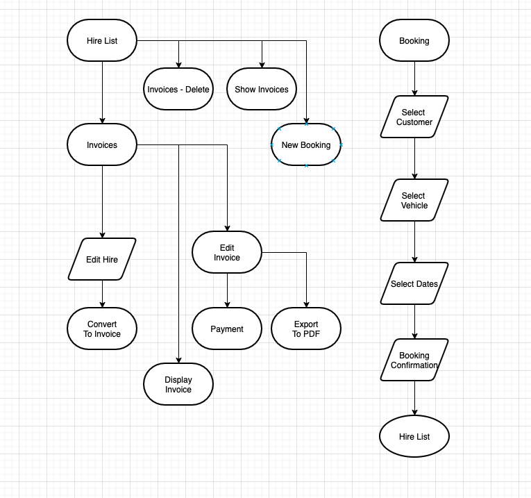
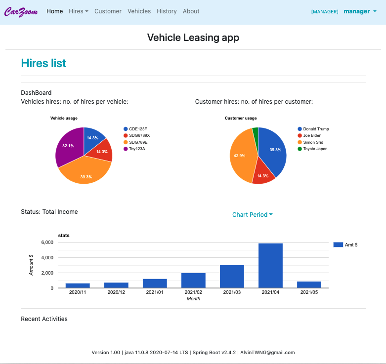
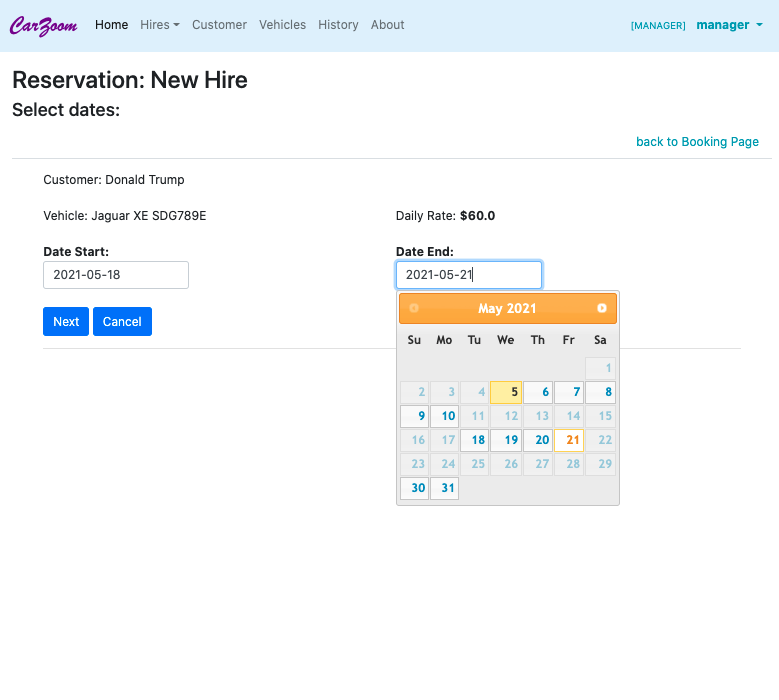
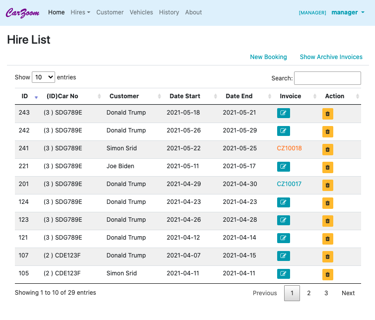

## CarZoom
### JAVA DEVELOPER Summative Capstone Project

#### This application system:
- based on Oracle database version 12c  to store all business data,
- using Java version 11, Spring Framework.
- accessible with Internet browsers, HerokuApp.
- utilizing Javascript, Thymeleaf, and Bootstrap for client side presentation, styling, and interaction,
- The system will be accessed only by Employees of the car rental company.
- Each Employee signs in with an assigned UserName and password.  Each Employee can inquire own personal details as well as change own password.
- An Employee with ADMIN Role will be initialized in the database and the access given to the system owner. Only Employees assigned ADMIN Role can create, modify Employee records, reset passwords, grant and revoke Employee Roles.  An Employee can be assigned zero, one, or more Roles.
- Each business operation requires specific Roles.  Only Employees granted those Roles can perform the business operation.
- Creation and deletion of Roles, as well as association of Roles to specific business operations is an application program maintenance task.  Association of Roles to specific Employees is however a business operation that requires ADMIN Role.
- Access to record deletion is granted only to Employees with ADMIN or MANAGER Roles.  Employee deletion is only allowed for ADMIN.  The physical deletion however will always be subject to referential integrity constraints in the database.

#### Business Operations by Roles:

ADMIN: for administrators
- Maintain system configuration parameters, such as:
- Create, modify, suspend Employees.  Suspended Employees are barred from log-in.
- Reset Employee passwords, Unsuspended Employees.
- Grant/Revoke Roles to Employees.

MANAGER :
- Create Vehicle into READY status.
- Maintain daily base rate for Cars, and other Car details.
- Set Car status to RETIRED.  Retired Cars cannot be hired.
- Suspend/Unsuspend Customers.
- Upload of picture for each car.  Pictures can be added, deleted, and reordered.  Pictures can be shown to aid choosing.

USER: for front desk who serve customers
- Create, Modify Customers.  Suspend Customers.
- There only be advance booking. Via select Customer, select Vehicle, select dates, and confirm the booking.
- All hires must be return before the return Date.
- Hire return date can be extended, provide the extended date is available.
- Hire can be edit prior to Convert to Invoice.
- An invoice generated on web page, can be exported to PDF format. One Invoice only associated with one Hire record.
- From the Hire records, a fleet utilization efficiency statistics will be generated and presented graphically.

---
### Deployment
Deployment at  https://carzoom.herokuapp.com/
* Above mentioned app is using free dynos. If first load fails, please reload
again.
* Explore with the credential: user/ user (subject to change).
* Developer explanation, Youtube : https://youtu.be/U4V75batZk8 .

---

### ER Diagram
This diagram helped to understand the structure of tables needed to persist the project data, and organize the bussiness model.   

---
### Sequence Diagram - EmpController
This kind of diagram was especially useful to understand the front controller functionality and the user journey.  

---
### Flow Chart
This flow chart show drop down menu from different users, Admin or User.
Admin, User Page   

The flow chart show the flow from Hire List, the new booking.   
 				

---
### Screen Shots
Home Page   

Select Date   

Hire List   

---
